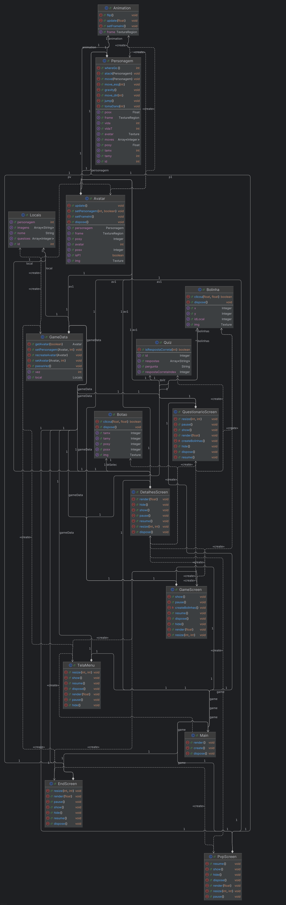

# Bagualo Fighter - Tales Cruz da Silva - Sistemas de Informação

### Alerta  - Muito Cuidado com o jogo, ele eventualmente suga toda a RAM do computador

### Desenvolvimento
Como a ideia do jogo era ambiciosa, iniciei o desenvolvimento muito antes, tão antes que o trabalho nem havia sido definido corretamente, o que gerou um grande problema posteriormente.

[Inicio do sofrimento](https://github.com/Talescruzs/JavaJoguinho)

### Diagrama gerado pelo IntelliJ

### Ideia do jogo
Com base na ideia passada pela professora, pensei em criar uma cópia do Street Fighter, mas com os personagens de cada local cultural relevante no nosso estado. No fim consegui apenas adicionar o Bagualossauro e 3 locais.

O quiz entra para determinar a vida do personagem, caso o jogador acerte a pergunta ela será de 100%, caso contrário 50%

Jogo feito para dois jogadores, com os movimentos:
p1:
 w(cima), a(esquerda), d(direita), f(ataque)
p2:
 seta cima, seta esquerda, seta direita, l(ataque)